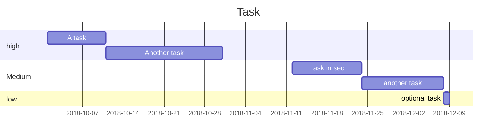

# DARWINX testbed project plan
-------
## What do you need to have? 
- [ ] Low voltage-central heating and cooling system
- [ ] At least one A-lamp fixture or easy-replacement downlights
- [ ] At least four (4) power plugs (including extensions) in the bedroom
- [ ] At least one in-wall Ethernet plug (do you mean router ethernet plug?)
- [ ] Beaded chain shades (roller only right?)
- [ ] Iphone
## what data are we going to collect from you?
Important: the identity of each subject will remain unknown to the system developers and administrators 

|Data collection|

| Parameters | Sampling time | Mounting method |
| -------- | -------- | -------- |
| Text     | Text     | Text     |

create a baseline of people behavior at home, especially sleep 
